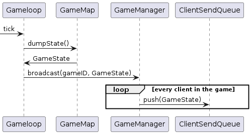

\pagebreak

# Architecture

# Network
The `Acceptor` class takes care of accepting incoming connections and creating an object (`ClientIOHandler`, which serves as glue to start/stop the send/recv threads) and registering it with `GameManager`, which assigns it a client ID.
`GameManager` is tasked with routing messages between clients and games, and handling the lifecycle of games (creation, joining, ending).

## Recv (C2S) path
There are three cases for a C2S message: actions within a game, creating/joining a game and listing games.

### In-game

### Creation/Joining

Joining is similar but doesn't need to create a new game.

### Listing games

## Send (S2C) path

# Protocol
All values are serialized in network order (BE).

F16/16 refers to fixed-point decimal with a u16 decimal part and a u16 fractional part. Serialized as an u32.

## Client-to-Server

### Header
The header consists of an u8 size field, that contains the size of the rest of the packet, and a u8 type action field.

The action field can take the following values:

+------------+-------+
| Action     | Value |
+============+=======+
| Create     | 'C'   |
+------------+-------+
| List       | 'L'   |
+------------+-------+
| Join       | 'J'   |
+------------+-------+
| Quit       | 'Q'   |
+------------+-------+
| Left       | 'A'   |
+------------+-------+
| Right      | 'D'   |
+------------+-------+
| Down       | 'S'   |
+------------+-------+
| Up         | 'W'   |
+------------+-------+
| Shoot      | 'P'   |
+------------+-------+
| Jump       | ' '   |
+------------+-------+
| Combo      | 'X'   |
+------------+-------+
| SwitchGun  | 'E'   |
+------------+-------+
| StopMoving | 'd'   |
+------------+-------+
| Ammo       | 'F'   |
+------------+-------+

NOTE: While most action values come from the keys that trigger them, a one-to-one correspondence shouldn't be assumed.

### Additional Values
Some actions take additional parameters

#### Create
Create takes a u16 characterID (see `AnimationState`), and a string containing the username serialized as an u8 size and the string itself.

#### Join
Create takes a u16 game id, a u16 characterID (see `AnimationState`), and a string containing the username serialized as an u8 size and the string itself.

#### Left/Right
Both take a u8 containing 1 if the player is moving fast and 0 otherwise.

## Server-to-Client
### Header
The header consists of a u16 containing the size of the payload and a u8 containing the type of message.

The type field can take the following values:

+-----------+-------+
| Type      | Value |
+===========+=======+
| GameList  | 0     |
+-----------+-------+
| GameState | 1     |
+-----------+-------+

### GameList
GameList informs the client of it's client ID and gives a list of available games.
It's format is a u16 containing the ID, and a list of `AvailableGame` (the quantity can be inferred from the length of the packet).

### AvailableGame
AvailableGame has a u16 game ID, a u8 with the amount of players joined and an u8 with the amount of players needed.

### GameState
Consists of an u8 containing the background, u16 containing seconds left in the game, u8 containing the player count, that amount of `Player`s, and the remainder of the packet contains `RenderableGameEntity`s

### Player
Each player contains a u16 ID, a u8 with it's healh, a u16 with it's score, a `RenderableGameEntity` with it's properties, and it's username in "u8 length + string" format.

### RenderableGameEntity
Contains X and Y in F16/16 format, a u8 entity type (see `AnimationState`), a u8 containing the animation (see `AnimationState`), a u8 containing the frame within the animation, and a i8 containing the direction (${\pm}1$).

# Game Logic
For every game tick, the following actions are performed.
- execute player actions
- apply gravity
- tick every entity
- reap dead entities
- send new state to the clients

## Entities
The `Entity` class provides both an interface that all entities must adhere to, and default implementations for all methods.

Of the methods, a couple might need additional explanation.

### onCollision
Should be called whenever an entity tries to move onto another.

The return value indicates how the entity that tried to move should behave:
- Transparent: you _should_ go over the entity. Example: decorative signs
- Passable: you _may_ go over the entity. Example: enemies
- Impassable: you _should not_ go over the entity. Example: walls

### send
Sends an arbitrary message. Is mostly used to signal to players. An example is the `coin` event.

Returns whether the entity knew how to handle the message.

# Commands
The server supports several commands, for debugging purposes.
Some commands require a gameID prefix (with a space between the ID and the command).

## listGames
`listGames` lists games, both active and inactive

## [id] list
List all entities

## [id] players
List all players

## [id] damage <entity> <dmg>
Deals `dmg` points of damage to entity with ID `entity`

## [id] tp <entity> <x> <y>
Teleports entity `entity` to (`x`, `y`), if possible.

## [id] enableDebug
Enables debug mode, which runs list every tick.

## [id] disableDebug
Disables debug mode

## [id] pause
Pauses the game. This doesn't prevent time from passing. Only use for debugging.

## [id] unpause
Unpauses the game.

## [id] tick
Manually ticks the game.

## [id] level <filename>
Manually loads a level _without removing the current one_. Only use for debugging.

# Levels
Levels are indicated by path when joining a game. Type refers to the implementation, ID refers to the entity type (for animation purposes), x and y are the initial coordinates of the top-left corner of the entity.

# Configuration
There are several configuration options available. Using dots in the name refers to nesting within the yaml structure.

Options are per-game-second, not per-tick.

## Important options
Important options most users will want to change or review.

### listen_port
Changes listen port.

### game.length_secs
Changes length of games, in game seconds (equal to real seconds by default).

### game.players
Amount of players per game. The game will not start until there are enough players.

## Debug Options
Useful for development/debugging.

### start_paused
Every game starts paused if enabled.

### physics.scaler
Scale between game time and real time. Makes time run faster (or slower) by that factor. 

## Tuning Options
Lets you change game behavior.

### physics.tps
Changes simulation speed. Do not set too high or clients won't be able to keep up.

### physics.gravity
Acceleration applied to every object.

### physics.impact_speed_reduction_factor
Convergence speed when impacting objects. Setting too low might hinder performance, setting too high might cause objects to hoover instead of fully making contact.

### entities.wandering.drops
Every enemy pulls drop information from here.
Each entry represents a drop type (`gem`, `rocket` and `fireball` are currently supported) and contains a probability.
Each drop type is evaluated in order until one is chosen or there are no more types.

### entities.[type].health
Health for entities of [type].

### entities.[type].damage
Damage for entities of [type].

# Known Bugs and Limitations
Creating more than $2^{16}$ games or clients will lead to bugs. This is easy to fix.
There is no easy way to describe non-rectangular hitboxes.
Client must obtain knowledge about available levels out-of-band.
Drop information can't be set for every enemy type.
