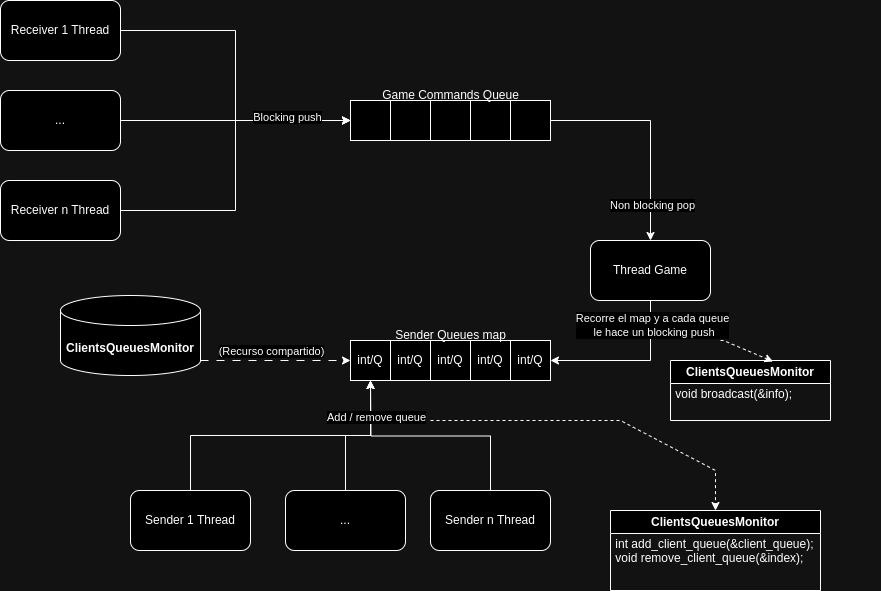

# Threads

Este TP utiliza los sockets desarrollados por eldipa aquí: https://github.com/eldipa/sockets-en-cpp, bajo licencia GPL v2.

Además utiliza Thread y Queue desarrollados por eldipa aquí: https://github.com/eldipa/hands-on-threads, bajo licencia GPL v2.

## Diagrama recursos compartidos

# Consideraciones y problemas encontrados.

## Uso de monitor
Los elementos compartidos por varios threads son: 
### Queue de comandos a ejecutar
Esta cola es compartida por todos los threads Receiver que escriben en ella, y por el thread del Game que saca los comandos a ejecutar.

Como la cola utilizada para esto es thread safe no hay race conditions posibles.

### Map de Queues de cada thread Sender
Como el Game debe conocer los clientes que están jugando y enviarles información por cada evento, se guardan en un map las queues de cada Sender asociado a un cliente.

Este map podría ser concurrentemente modificado por cada hilo Sender (añadiendo o removiendo su cola del map). Y además, consultado por el hilo Game, que itera sobre cada cola pusheando información del evento ocurrido. Entonces, para evitar race conditions se protege con un mutex cada uno de estos métodos, para que si un hilo está consultando o modificando el map, otro no pueda hacerlo hasta que no haya terminado el otro (soltado el lock).

## Creación y finalización de hilos
Cada hilo que crea otro hilo, es a su vez el encargado de cerrarlo. Para esto es necesario asegurarse de que todo hilo derivado de otro termine correctamente y que no se quede esperando indefinidamente el join().

### Desconexión del cliente
En este caso, hice que el hilo Sender cree a el hilo Receiver. Como ambos comparten el mismo protocolo, agregué un "std::atomic bool was_closed" al protocolo para que tenga actualizado el estado del socket cliente de una forma thread safe, ya que puede ser modificado ese booleano por el hilo Sender o el Receiver, al enviar o recibir mensajes por el socket. Usando luego este valor para saber si tenía que terminar los hilos, porque se había desconectado el cliente.

### Recepción de 'q' para finalización del Server.
El server corría siempre aparte en su hilo main, detectando por la 'q' para cerrar el programa.

Cuando cerraba el programa desde el server, para que el hilo Acceptor pueda hacer el join() correctamente, antes se llamaba a stop() que cerraba el socket aceptador, para que no se quede bloqueado este en el accept(). Al cerrarlo forzosamente, se lanzaba una exepción que era atrapada y continuando el programa.

Luego, también podía estar bloqueado el pop() del sender al querer cerrar el programa. Lo que hice fue llamar al stop() del sender desde el hilo Acceptor, que cerraba la cola del sender. En este caso también se lanzaba una excepción, que se atrapaba para continuar el programa.

## Utilización de Bounded Blocking Queues
Se utilizaron queues con límites, que se bloqueen en caso de estar llenas y querer hacer push(), o en caso de estar vacías y querer hacer pop().

Esto porque me pareció correcto administrar bien la memoria en vez de simplemente agregar más.
